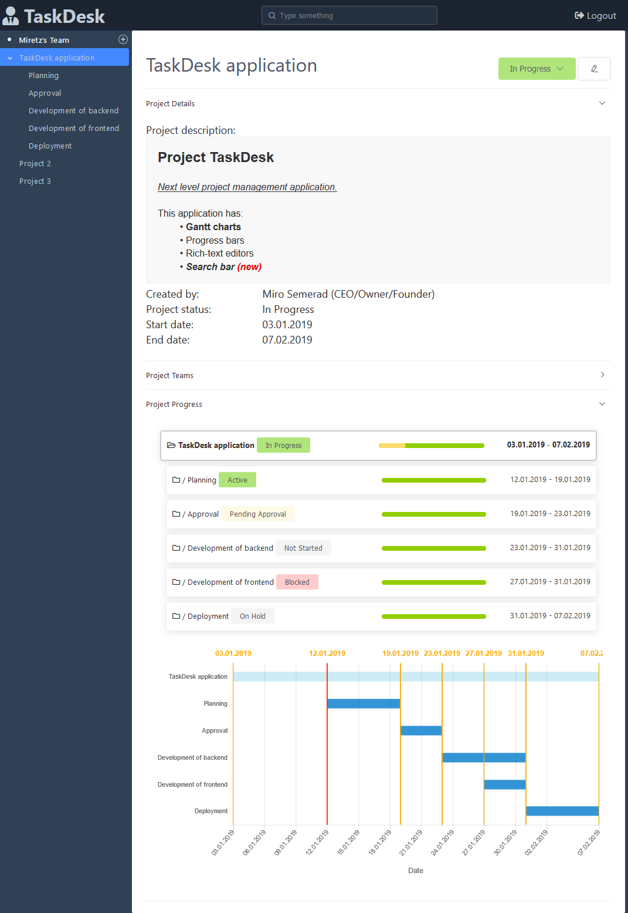

# pmtool

**Warning: Work in progress. This project is in a very early stage.**

Modern project management tool with advanced analytics.

## Technologies:
- Vue.js
- Chart.js
- Element UI
- Node.js
- Apollo
- GraphQL
- MongoDB
- ...

## Goals
- Tracking and reporting on long term projects.
- Visualization of project and employee statistics.
- High degree of customization to support many types of organizations.
- Built on modern and highly scalable technologies.

## What is done
- Separate frontend and backend (can be run on separate instances)
- GraphQL API
- Basic security and registration
- Project structure and nesting
- Rich text editor for project description
- Project start and end date - datepicker
- Visualization of project progress
- Simple Gantt chart for subprojects

## TODO
- Project status tracking
- Responsive UI layout
- Team and personal allocation management
- Integration with security providers
- More visualizations - employee allocation, project spending, etc. 
- Project deadline/delay prediction
- Tests
- ...

